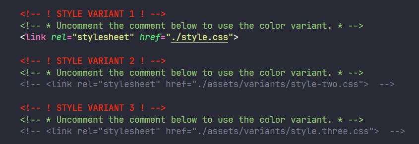

# Shajid Shafee Portfolio
You can find my Portfolio with 3 color variants with mobile responsive (_<600px max-width screen sizes_). You can view it here with the detailed instruction below for your convenience. 

|  |  |
|--|--|
| **License** |MIT  |
| **Stacks** |HTML & CSS  |
| **Author** |M. Shajid Shafee  |
| **Live Link** | https://mshajid.github.io/project-portfolio/ |
| **Color Pallets** | https://colorhunt.co/ |

### Screenshots
All color variants are below. Color pallets are generated with the [Color Hunt](https://www.colorhunt.co). 

#### Color Variant 1

#### Color Variant 2

#### Color Variant 3

### Instructions

Before you dive into the code, better to have the VS code extension called "Better Comments" by **Aaron Bond**. Follow these instructions to see the color variants properly.

- First fork the repository. 
- Simply navigate to the index.html and keep the stylesheet which color variant you would like to have, and rest of them uncomment to avoid the conflict.
- Optional: Keep the "Better Comment" VS code extension to see the comment clearly with the highlight. 

